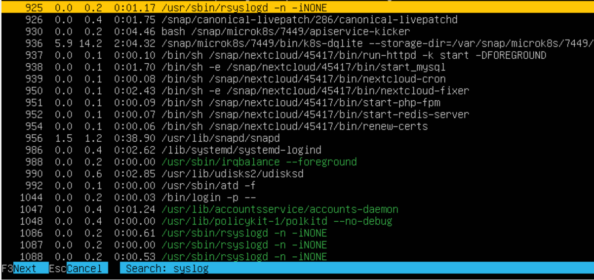
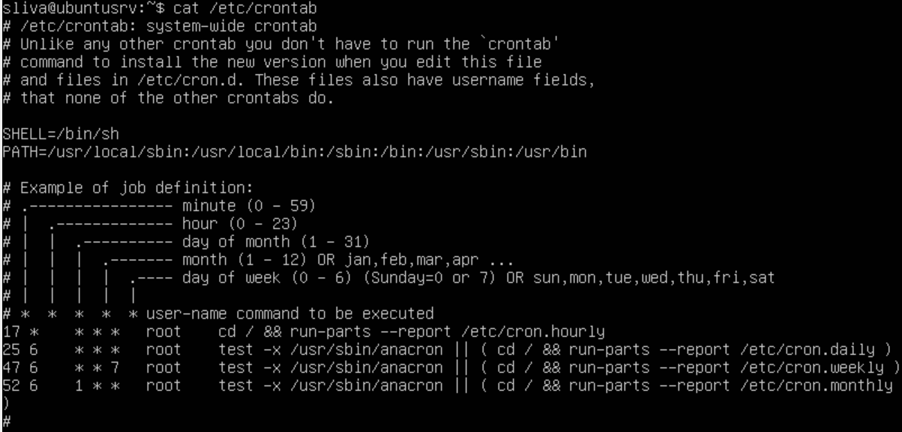

## Решение

[Part 1. Установка ОС](#part-1-установка-ос)

[Part 2. Создание пользователя](#part-2-создание-пользователя)

[Part 3. Настройка сети ОС](#part-3-настройка-сети-ос)

[Part 4. Обновление ОС](#part-4-обновление-ос)

[Part 5. Использование команды **sudo**](#part-5-использование-команды-sudo)

[Part 6. Установка и настройка службы времени](#part-6-установка-и-настройка-службы-времени)

[Part 7. Установка и использование текстовых редакторов](#part-7-установка-и-использование-текстовых-редакторов)

[Part 8. Установка и базовая настройка сервиса **SSHD**](#part-8-установка-и-базовая-настройка-сервиса-sshd)

[Part 9. Использование утилит **top**, **htop**](#part-9-использование-утилит-top-htop)

[Part 10. Использование утилиты **fdisk**](#part-10-использование-утилиты-fdisk)

[Part 11. Использование утилиты **df**](#part-11-использование-утилиты-df)

[Part 12. Использование утилиты **du**](#part-12-использование-утилиты-du)

[Part 13. Использование утилиты **ncdu**](#part-13-использование-утилиты-ncdu)

[Part 14. Работа с системными журналами](#part-14-работа-с-системными-журналами)

[Part 15. Использование планировщика заданий **CRON**](#part-15-использование-планировщика-заданий-cron)

## Part 1. Установка ОС

- ##### Установлена OS Ubuntu 20.04 Server LTS без графического интерфейса с использованием программы для виртуализации — VirtualBox ver. 7.0.22. 

- ##### Вывод команды cat /etc/issue : Ubuntu 20.04.6 LTS  
   
 

## Part 2. Создание пользователя

- ##### Вызов команд для создания нового пользователя и внесение в группу "adm".    
   
 ###### `sudo adduser newuser`:  

 

 ###### `sudo usermod -aG adm newuser`:  

 

 ###### `groups newuser`:  
    
 

- ##### Вывод команды  `cat /etc/passwd`:  
 
   

 
 

## Part 3. Настройка сети ОС  

- ##### Изменение имени хоста (машины) консольной    командой  
 
 ###### `hostnamectl set-hostname <new name host>`:newuser-1  

   

- ##### Установка временной зоны, соответствующей моему текущему местоположению.  
 
 ###### `sudo timedatectl set-timezone Europe/Moscow`:  

 

- ##### Вывод названий сетевых интерфейсов с помощью консольной команды.  
 
 ###### `ip link show`:  

 

  _Интерфейс lo (loopback) присутствует на всех системах. Он используется для тестирования и диагностики сетевых приложений и служб на локальном компьютере._

  __Основные функции интерфейса lo:__  
    * _Позволяет программам на одном и том же компьютере общаться друг с другом через сетевые протоколы, как если бы они находились на разных машинах._  
    * _используется для тестирования сетевых приложений без необходимости подключения к внешней сети._  
 
- ##### Консольная команда получения ip адреса от DHCP-сервера  для используемого устройства.

 ###### `sudo dhclient -v`:  

   

 __Основные функции DHCP:__  
      - _Автоматическое назначение IP-адресов: DHCP-сервер автоматически назначает IP-адреса устройствам, подключенным к сети._  
      - _Управление IP-адресами: DHCP-сервер отслеживает, какие IP-адреса уже назначены, и гарантирует, что каждый адрес уникален в пределах сети._  
      - _Обновление конфигурации: DHCP позволяет легко обновлять сетевые настройки устройств, например, при изменении DNS-серверов или шлюза._
    
 __Преимущества использования DHCP:__  
     - _Упрощение администрирования сети:_ _Нет необходимости вручную настраивать каждый компьютер._
     - ___Гибкость:___ _Легко изменять сетевые параметры для всех устройств в сети._
     - ___Эффективное использование IP-адресов:___ _DHCP-сервер может повторно использовать IP-адреса, которые больше не используются._

- ##### Вывод на экран внешнего ip-адреса шлюза  
 
 ###### `curl ifconfig.me`: 88.85.172.5  

 
     
- ##### Вывод на экран внутреннего ip-адреса шлюза (он же шлюз (gw) по умолчанию)  
 
 ###### `ip route show`: 10.0.2.2  

 

- ##### Для установки и применения статических настроек сети редактируем файл /etc/netplan/00-installer-config.yaml  

 ###### `sudo nano /etc/netplan/00-installer-config.yaml`  

 

 ##### _В файле произведены следующие замены:_  

   1. _Отключена раздача адресов сервером DHCP_: `dhcp4: no`  
    
   2. _Присвоен статический сетевой адрес для устройства_ 
   `addresses:`  
     `- 10.0.2.20\24`  

   3. _Добавлено статическое использование публичных DNS-серверов_  
    `nameservers:`  
        `addresses:`  
            `- 8.8.8.8`   
            `- 1.1.1.1`   
        
 ##### _После сохранения файла произведено применение настроек сети командой:_ `sudo netplan apply`  

 
      
- ##### После перезагрузки виртуальной машины все статичные сетевые настройки (ip, gw, dns) соответствуют заданным в предыдущем пункте. 

 ###### `ip addr show`:  

 

 ###### `ip route show`:  

 

 ###### `systemd-resolve --status`:  

 

- ##### С текущими настройками команда `ping` на удаленные хосты __1.1.1.1__ и __ya.ru__ прошла успешно, без потерь сетевых пакетов.

 ###### `ping 1.1.1.1`:  

 

 ######  `ping ya.ru`:  

 

## Part 4. Обновление ОС  

- ##### Обновление системных пакетов до последней версии на момент выполнения задания.  
 
  `sudo apt update`:  

   
 
 * Обновление пакетов    
   
 `sudo apt upgrade`:  
  
   

- ##### Повторный ввод команды обновления после обновления системных пакетов (сообщение, что пакеты для обновления отсутствуют)  
 
 `sudo apt upgrade`:  

 

## Part 5. Использование команды **sudo**  

- ##### Разрешение пользователю (newuser) выполнять команду sudo.  
 
 `sudo usermod -aG sudo newuser`  

    

   __Команда sudo__ (сокращение от "superuser do") в Unix-подобных операционных системах, таких как Linux, позволяет пользователю выполнять команды с привилегиями суперпользователя (root). Это важно для выполнения задач, требующих повышенных прав доступа, таких как установка программного обеспечения, изменение системных настроек или управление пользователями.

   __Основные преимущества использования sudo:__

   * Безопасность: Вместо того чтобы постоянно работать под учетной записью root, пользователи могут временно получать привилегии суперпользователя только для выполнения конкретных команд. Это снижает риск случайных или вредоносных изменений в системе.

   * Аудит и контроль: Все команды, выполненные с использованием sudo, записываются в журнал, что позволяет администраторам отслеживать действия пользователей и выявлять потенциальные проблемы.

   * Гибкость: Администраторы могут настроить файл конфигурации /etc/sudoers, чтобы предоставить разные уровни доступа различным пользователям или группам пользователей.

- ##### Замена hostname ОС от имени `newuser`, используя sudo.  
 
 

   
 

 

   
 

## Part 6. Установка и настройка службы времени  

- ##### Время часового пояса  
 
   

- ##### Вывод `timedatectl show`  
  
  

## Part 7. Установка и использование текстовых редакторов 
- #### Создание и редактирование файлов в редакторах: vim, nano, mcedit.  
 
 `vim test_vim.txt` :  
  
   

 для выхода c сохранением: `:wq`  

 `nano test_nano.txt` :  
  
   

 для выхода c сохранением : `CTRL+o`->`(test_nano.txt) Enter`->`CTRL+x`  

 `mcedit test_mcedit.txt` :  
   
   

 для выхода c сохранением: `F2`->`[save] (test_mcedit.txt) Enter` -> `F10`  

- ##### Редактирование файлов без сохранения  
 
 `vim test_vim.txt` :  
   
   

 для выхода без сохранения: `:q!`    

 `nano test_nano.txt` :  

   

 для выхода без сохранения:`CTRL+x`->`n`

 `mcedit test_mcedit.txt` :  
   
   

 для выхода без сохранения: `F10`-> в приглашении `No`  

- ##### Поиск по содержимому файла (слово) и замена слова на любое другое.  
 
 `vim search` :  
 
   
  
 `nano search` :  
   
   
    
 `mcedit search` :  
    
   

 `vim replace` :  
    
   
    
 `nano replace` :  
    
   
    
 `mcedit replace` :  
    
   
      

## Part 8. Установка и базовая настройка сервиса **SSHD**

 - ##### Установка службы SSHd.  
 
   

 - ##### Добавление автостарта службы при загрузке системы.  
 
 

   
 

    

 - ##### Перенастрока службы SSHd на порт 2022.  
    

 - ##### Команда `ps` отображает информацию о текущих процессах, запущенных на системе. Она позволяет получать информацию о процессах, таких как идентификатор процесса (PID), использование CPU и оперативной памяти, время работы и многое другое.
 
     
  
   __Пояснение команды и ключей__  

   1. `a` - ключ, который указывает команде `ps` отобразить процессы всех пользователей, а не только текущего пользователя. Это позволяет увидеть процессы, которые запущены другими пользователями системы.

   2. `u` - ключ, который выводит более подробную информацию о процессах, включая имя пользователя, использующего процесс, и использование ресурсов (CPU и память).

   3. `x` - ключ, который показывает процессы, не привязанные к терминалу. Это полезно, чтобы увидеть все процессы, даже те, которые не находятся в интерактивных сеансах.

   4. `grep sshd` - это команда, которая фильтрует вывод предыдущей команды `ps aux`, выводя только те строки, которые содержат слово `sshd`. `sshd` - это демон SSH (Secure Shell), который отвечает за прием входящих SSH-соединений.

- ##### Команда `netstat` — это инструмент для мониторинга сетевых соединений на сервере. 

  

  __Разбор ключей `-tan`:__
    `-t`: Этот ключ указывает команде `netstat`, что нужно отображать только соединения протокола TCP. То есть, вы будете видеть только TCP-соединения, игнорируя другие протоколы (например, UDP).
    `-a`: Этот ключ сообщает `netstat` показать все соединения и сокеты, включая установленные соединения и прослушивающие порты.
    `-n`: Этот ключ заставляет `netstat` показывать адреса и порты в числовом формате, а не преобразовывать их в человеко-читаемые имена (например, вместо того, чтобы показывать доменные имена, будет отображаться IP-адрес).

  __Значение каждого столбца:__
     1. Proto: Протокол, используемый для соединения (например, TCP).
     2. Recv-Q: Количество байтов, ожидающих чтения в очереди приёма. Если значение больше 0, это может указывать на то, что приложение не читает данные.
     3. Send-Q: Количество байтов, ожидающих отправки в очереди передачи. Значение больше 0 может указывать на проблемы с сетью или приёмником, принимающим данные.
     4. Local Address: Локальный адрес и порт, на которых ваше приложение слушает или с которым оно установило соединение. Например, `0.0.0.0:22` означает, что служба прослушивает на порту 22 на всех доступных интерфейсах.
     5. Foreign Address: Адрес и порт удалённого соединения. Если соединение не активно, поле может содержать символ `*`.
     6. State: Состояние соединения. Примеры состояний: 
       - `LISTEN`: сокет ожидает входящие соединения.
       - `ESTABLISHED`: соединение активно и данные могут передаваться.

  __Значение `0.0.0.0`__
    `0.0.0.0` в выводе указывает на то, что сервис принимает соединения на всех доступных сетевых интерфейсах. Это значит, что он будет принимать соединения не только с локального хоста, но и с любых удалённых адресов. Это часто используется для служб, которые должны быть доступны из любого места.

## Part 9. Использование утилит **top**, **htop**

- ##### top

  

- По выводу команды top определил:
  - uptime - `1:09 min`;
  - количество авторизованных пользователей - `1 user`;
  - среднюю загрузку системы - `1.31, 1.17, 1.10`;
  - общее количество процессов - `165` ;
  - загрузку cpu - `5.4 us` и `5.7 sy` ;
  - загрузку памяти - `1971.3 total` > `971.7 used` ; 
  - pid процесса занимающего больше всего памяти - `4298` ;
  - pid процесса, занимающего больше всего процессорного времени - `4298`.

- ##### htop. 
  - отсортировано по:
 
 `PID`

    
  
 `PERCENT_CPU`  

    
  
 `PERCENT_MEM` 

    
  
 `TIME`

    
   
  - отфильтровано для процесса sshd:

   

 - с процессом syslog, найденным, используя поиск;

   

 - с добавленным выводом hostname, clock и uptime. 

    

## Part 10. Использование утилиты **fdisk**

- ##### Команда fdisk.

 `fdisk -l`  

  

- 
  - название жесткого диска - sda;
  - размер  - 40 Gb;
  - количество секторов - 83886080;
  - размер swap - 2 Gb
    
 

## Part 11. Использование утилиты **df** 

- ##### Команда df.  

  

* 
    - размер занятого пространства - 19430032 KB;
    - размер свободного пространства - 9906732 KB;
    - процент использования - 47%;
    - единицу измерения в выводе - в "1K-блоках", что означает, что размеры округляются до килобайтов. 

- ##### Запуск df -Th.  
   
  

* - размер раздела - 19 Gb;
  - размер занятого пространства - 8.2 Gb;
  - размер свободного пространства - 9.5 Gb;
  - процент использования - 47%;
  - тип файловой системы для раздела - ext4.

## Part 12. Использование утилиты **du**  

- ##### Размер папок /home, /var, /var/log (в байтах, в человекочитаемом виде).

  

- ##### Размер всего содержимого в /var/log (не общее, а каждого вложенного элемента, используя *).  

`du -sh /var/log/*`

 

## Part 13. Использование утилиты **ncdu**

- ##### ncdu /home, /var, /var/log.

 

## Part 14. Работа с системными журналами

- ##### 1. /var/log/dmesg

 

- ##### 2. /var/log/syslog

- ##### 3. /var/log/auth.log  

  

* 
   * время последней успешной авторизации - Dec 16 19:53:48
   * имя пользователя - sliva
   * метод входа в систему - локальный вход через терминальную консоль tty1.

## Part 15. Использование планировщика заданий **CRON**

 - ##### Задача из планировщика cron.

  `crontab -e`

  

 
 

 

 - ##### Cписок текущих заданий для CRON.

 `cat /etc/crontab`

   