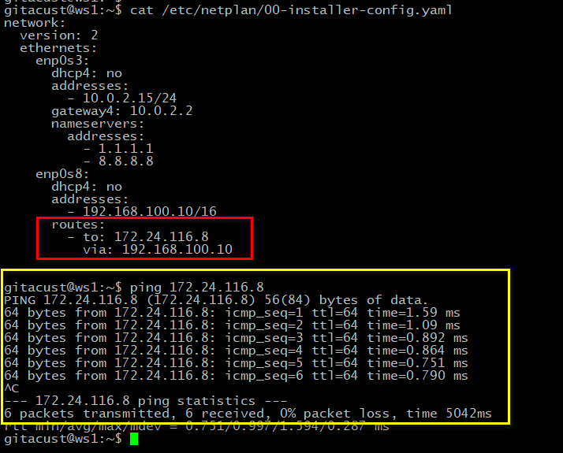
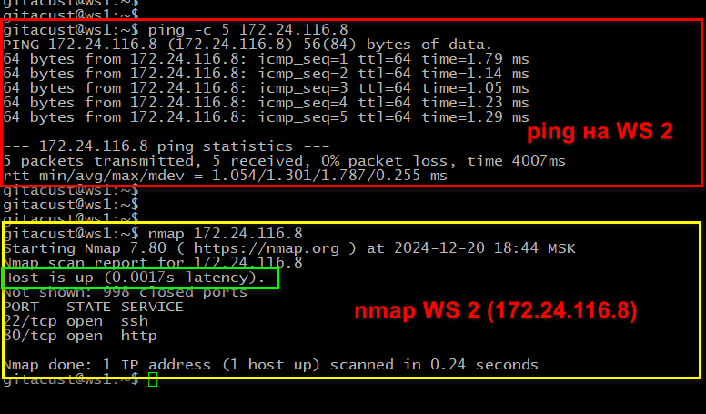
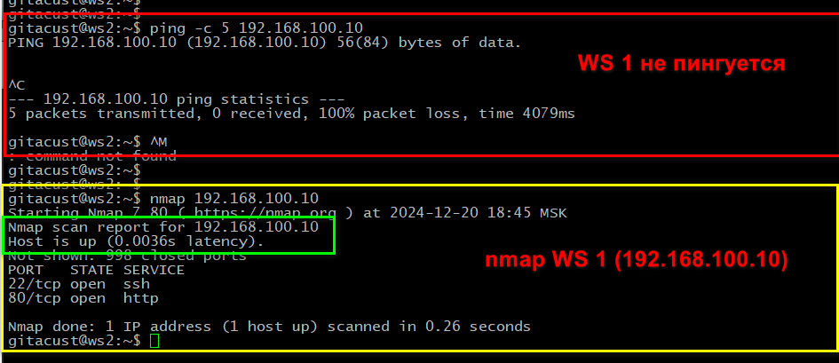
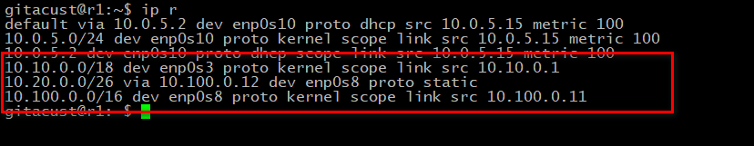
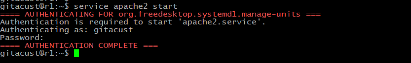
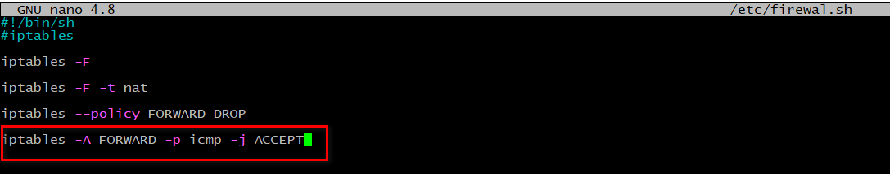
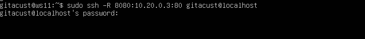

# Содержание решения "Сети в Linux"

1. [Инструмент ipcalc](#part-1-инструмент-ipcalc) 
2. [Статическая маршрутизация между двумя машинами](#part-2-статическая-маршрутизация-между-двумя-машинами)
3. [Утилита iperf3](#part-3-утилита-iperf3) 
4. [Сетевой экран](#part-4-сетевой-экран) 
5. [Статическая маршрутизация сети](#part-5-статическая-маршрутизация-сети) 
6. [Динамическая настройка IP с помощью DHCP](#part-6-динамическая-настройка-ip-с-помощью-dhcp) 
7. [NAT](#part-7-nat) 
8. [Допополнительно. Знакомство с SSH Tunnels](#part-8-дополнительно-знакомство-с-ssh-tunnels)

## Part 1. Инструмент **ipcalc**

#### Виртуальная машина "ws1"

`hostname`

#### 1.1. Сети и маски
##### 1) `ipcalc 192.167.38.54/13`  

##### 2) Перевод маски
   - `ipcalc 1.1.1.1/255.255.255.0` в префиксную и двоичную запись 
 
 

 
   - `ipcalc 1.1.1.1/15` в обычную и двоичную

  

 
   - *11111111.11111111.11111111.11110000* в обычную и префиксную.  
  Чтобы определить префиксную запись, нужно в двоичной системе подсчитать количество единиц (1). 
  Это число будет указывать на префикс. Таким образом префикс маски из задания: */28* 

`ipcalc 1.1.1.1/28`

##### 3) Минимальный и максимальный хост в сети *12.167.38.4* при масках: 

   - */8*

`ipcalc 12.167.38.4/8`

   - *11111111.11111111.00000000.00000000* 

`ipcalc 12.167.38.4/16` 

   - *255.255.254.0* 

`12.167.38.4/255.255.254.0`

   - */4*  

`ipcalc 12.167.38.4/16` 

#### 1.2. localhost
   _Согласно RFC 3330 для сети `localhost` выделен пул адресов:
   "127.0.0.0/8 - Этот блок назначен для использования в качестве
   адреса обратной связи с хостом в Интернете.
   Дейтаграмма, отправленная по протоколу более высокого уровня 
   на адрес в любом месте этого блока, должна возвращаться обратно
   в хост. Обычно это реализуется с использованием только 127.0.0.1/32
   для обратной связи, никакие адреса в пределах этого блока никогда 
   и нигде не должны появляться в какой-либо сети [RFC1700, page 5]."_

   Выделенный диапазон адресов `ipcalc 127.0.0.0/8`

  

Таким образом к приложению, работающему на localhost:  
   -  можно обратиться с IP-адресов: *127.0.0.2*, *127.1.0.1*, 
   -  нельзя обратиться с IP-адресов: *194.34.23.100*, *128.0.0.1*

#### 1.3. Диапазоны и сегменты сетей

_Документ RFC 1918, также известный как Request for Comment 1918  был использован для создания
стандартов, в которых сетевое оборудование назначает IP-адреса в частной сети. Частная сеть
может использовать один общедоступный IP-адрес. RFC резервирует следующие диапазоны IP-адресов,
которые не могут быть маршрутизированы в Интернете:_
**10.0.0.0 – 10.255.255.255 (префикс 10/8)
172.16.0.0 – 172.31.255.255 (префикс 172.16/12)
192.168.0.0 – 192.168.255.255 (префикс 192.168/16)**
_IP-адреса в этих диапазонах могут быть назначены в рамках **частной сети**.Частные IP-адреса 
не могут передаваться напрямую через внешние компьютеры, поскольку они не являются глобально
уникальными и не могут быть адресованы в общедоступном Интернете._

##### 1) Использование IP-адресов:
- В качестве публичных использовать адреса:
  - 134.43.0.2
  - 172.0.2.1
  - 192.172.0.1
  - 172.68.0.2
  - 192.169.168.1

- В качестве частных использовать адреса:
  - 10.0.0.45
  - 192.168.4.2
  - 172.20.250.4
  - 172.16.255.255
  - 10.10.10.10

##### 2) IP-адрес шлюза сети *10.10.0.0/18*: 

Сетевой шлюз — это устройство или программное обеспечение, которое служит точкой доступа между 
различными сетями или между сетью и интернетом. Каждый сетевой шлюз имеет **уникальный адрес в пределах своей сети.**

``ipcalc 10.10.0.0/18``  

  

Таким образом IP-адресом шлюза для сети **10.10.0.0/18** могут быть адреса:
- *10.10.0.2* 
- *10.10.10.10*
- *10.10.1.255*

## Part 2. Статическая маршрутизация между двумя машинами

##### Виртуальные машины (ws1 и ws2).

``hostname; cat /etc/ussue``:

 

 

##### Cетевые интерфейсы.

- ws1:
`ip a` 

 

- ws2:
`ip a` 

 

##### IP-адреса внутренней (локальной) сети
- ws1:  192.168.100.10/16  
`cat /etc/netplan/00-installer-config.yaml`  

  

- ws2: 172.24.116.8/12  
`cat /etc/netplan/00-installer-config.yaml`

  

#####  Применение изменений на обеих машинах 
- ws1: 
`netplan apply`  
`ip a` 

 

- ws2: 
`netplan apply`  
`ip a` 

 

#### 2.1. Добавление статического маршрута вручную

- ws1: 
`ip r add 172.24.116.8 dev enp0s8`  
`ping 172.24.116.8`

 

- ws2: 
`ip r add 192.168.100.10 dev enp0s8`  
`ping 192.168.100.10`

 

#### 2.2. Добавление статического маршрута с сохранением
##### Добавление статического маршрута от одной машины до другой с помощью файла 
*/etc/netplan/00-installer-config.yaml*.
- ws1:
`cat /etc/netplan/00-installer-config.yaml`
`ping 172.24.116.8`  

 

- ws2:
`cat /etc/netplan/00-installer-config.yaml`
`ping 192.168.100.10`  

 

## Part 3. Утилита **iperf3**

#### 3.1. Скорость соединения
 - 8 Mbps = 1 MB/s
 - 100 MB/s = 800000 Kbps
 - 1 Gbps = 1000 Mbps

#### 3.2. Утилита **iperf3**
##### Cкорость соединения между ws1 и ws2.

- ws1 "Server":
`iperf3 -s`  

 

- ws2 "Client":
`iperf3 -c 192.168.100.10`  

 

## Part 4. Сетевой экран
#### 4.1. Утилита **iptables**
##### Создай файл */etc/firewall.sh*, имитирующий файрвол, на ws1 и ws2:
- ws1:
`/etc/firewall.sh`  

 

- ws2:
`/etc/firewall.sh`  

 
Разница стратегий заключается в работе iptables, которая применяет правила работы
 с пакетами в порядке добавления этих правил "сверху-вниз". 
WS 1 в цепочкe OUTPUT сначала применяет правило "сброса" всех пакетов ответа icmp-replay
протокола icmp-type, который использует команда `ping`, таким образом пакеты ответов 
не уходят на хост запрашивающего и машина "не пингуется".
В WS 2 в той же цепочке OUTPUT правило разрешения прохождения тех же самых пакетов 
расположено раньше и таким образом применяется первым - машина WS 2 "пингуется".

- ws1:
`chmod +x /etc/firewall.sh` и `/etc/firewall.sh`

 
- ws2:
`chmod +x /etc/firewall.sh` и `/etc/firewall.sh`

 

#### 4.2. Утилита **nmap**

  - ws1:`ping` и `nmap`

 

  - ws2:`ping` и `nmap`

 

## Part 5. Статическая маршрутизация сети

Сеть: \

#### 5.1. Настройка адресов машин

- ws11 `*etc/netplan/00-installer-config.yaml*`

 

- ws21 `*etc/netplan/00-installer-config.yaml*`

 

- ws22 `*etc/netplan/00-installer-config.yaml*`

 

- r1 `*etc/netplan/00-installer-config.yaml*`

 

- r2 `*etc/netplan/00-installer-config.yaml*`

 

- ws11 `ip -4 a`

 

- ws21 `ip -4 a`

 

- ws22 `ip -4 a`

 

- r1 `ip -4 a`

 

- r2 `ip -4 a`

 

- ws22 `ping 10.20.0.10`

 

- ws21 `ping 10.20.0.20`

 

- r1 `ping 10.10.0.2`

 

- ws11 `ping 10.10.0.1`

 

#### 5.2. Включение переадресации IP-адресов на роутерах

- r1: `sysctl -w net.ipv4.ip_forward=1`

 

- r2: `sysctl -w net.ipv4.ip_forward=1`

 

*При таком подходе переадресация не будет работать после перезагрузки системы.*

##### Изменение файла */etc/sysctl.conf*:

- r1: `sudo nano /etc/sysctl.conf`

 

- r2: `sudo nano /etc/sysctl.conf`

 

*При использовании этого подхода, IP-переадресация включена на постоянной основе.*

#### 5.3. Установка маршрута по умолчанию

- ws11 `cat etc/netplan/00-installer-config.yaml`

 

- ws21 `etc/netplan/00-installer-config.yaml`

 

- ws22 `cat etc/netplan/00-installer-config.yaml`

 

##### Добавился маршрут в таблицу маршрутизации.

- ws11 `ip r`

 

- ws21 `ip r`

 

- ws22 `ip r`

 

##### Пинг с ws11 на роутер r2

- ws11: `ping 10.100.0.12`
- r2 `tcpdump -tn -i enp0s8`

 

#### 5.4. Добавление статических маршрутов в роутеры

- r1 `cat /etc/netplan/00-installer-config.yaml`

 

- r2 `cat /etc/netplan/00-installer-config.yaml`

 

##### Таблицы с маршрутами на обоих роутерах.

- r1 `ip r`

 

- r2 `ip r`

 

##### Запусти команды на ws11:

- ws11 
`ip r list 10.10.0.0/18`
`ip r list 0.0.0.0/0`

 

Приоритизация маршрутов играет важную роль в определении,
какой маршрут будет использоваться для передачи пакетов.
В маршрутизаторах маршруты с более высоким уровнем спецификации 
(то есть с более длинными префиксами) имеют приоритет над более общими маршрутами. 
Это означает, что если существует более конкретный маршрут, он будет выбран 
вместо маршрута по умолчанию. В нашем случае маршрут 10.10.0.0/18 более приоритетный 
по сравнению с маршрутом 0.0.0.0/0, и именно поэтому он используется для трафика, 
направляемого к адресу в указанном диапазоне.

#### 5.5. Построение списка маршрутизаторов

- r1 
`tcpdump -tnv -i enp0s3`

  
 
 - ws11 
 `traceroute 10.20.0.10`

 

Для доставки пакета от исходного узла ws11 с ip-адресом 10.10.0.2 к конечному узлу 
ws21 с ip-адресом 10.20.0.10 необходимо пройти несколько этапов. 
Пакет направляется к шлюзу с ip-адресом 10.10.0.1., пересылается на шлюз 10.100.0.12, который, в свою очередь, направляет его в целевую подсеть 10.20.0.0/26.
Каждый пакет, отправленный в сети, проходит через определенное количество узлов прежде
чем достигнет своей конечной цели.
Каждый пакет имеет свое время жизни. Это количество узлов, которые может пройти пакет перед тем,
как он будет уничтожен. Этот параметр записывается в заголовке TTL, каждый маршрутизатор,
через который будет проходить пакет, уменьшает его на единицу. При TTL=0 пакет уничтожается,
а отправителю отсылается сообщение Time Exceeded.
Команда traceroute в Linux использует UDP пакеты. Она отправляет пакет с TTL=1 и смотрит адрес ответившего
узла, дальше TTL=2, TTL=3 и так пока не достигнет цели. Каждый раз отправляется по три пакета
и для каждого из них измеряется время прохождения. Пакет отправляется на случайный порт, который,
скорее всего, не занят. Когда утилита traceroute получает сообщение от целевого узла о том, что порт
недоступен, трассировка считается завершенной.

#### 5.6. Использование протокола **ICMP** при маршрутизации
##### Перехват сетевого трафика, проходящего через интерфейс:

- r1: `tcpdump -n -i eth0 icmp`
- ws11`ping -c 1 10.30.0.111`

## Part 6. Динамическая настройка IP с помощью **DHCP**

##### 1) настройка файла */etc/dhcp/dhcpd.conf* на r2:

##### 2) Файл *resolv.conf* на r2

##### Перезагрузка службы **DHCP** на r2 

`systemctl restart isc-dhcp-server`. 

##### Перезагрузка и получение адреса ws21:

- ws21
  `ping 10.20.0.20`

##### MAC-адрес ws11

- `cat /etc/netplan/00-installer-config.yaml`
 

 
##### 1) настройка файла */etc/dhcp/dhcpd.conf*  на r1:

##### 2) Файл *resolv.conf* на r1

##### Перезагрузка службы **DHCP** на r1 

`systemctl restart isc-dhcp-server`. 

##### Обновление адреса ws21 от DHCP:

`dhclient -v`
  

## Part 7. **NAT**

#####   сервер Apache2 

- ws22 
`sudo cat /etc/apache2/ports.conf` 
  

- r1 
`sudo cat /etc/apache2/ports.conf` 

##### Запуск веб-сервера Apache 

- ws22
`service apache2 start` 

- r1
`service apache2 start` 

##### Фаервол на r2

##### Запуск файла
- r2
`sudo chmod +x /etc/firewall.sh`
`sudo /etc/firewall.sh`

- r1 
`ping 10.20.0.3`

##### Добавление правила, разрешающего маршрутизацию  всех пакетов протокола **ICMP**.

- r2
`sudo /etc/firewall.sh`

- r1 
`ping 10.20.0.3`

##### Добавь в файл ещё два правила:
##### 5) **SNAT**
##### 6) **DNAT** на 8080 порт машины r2 и  к веб-серверу Apache, запущенному на ws22, доступ извне сети.

 - r2
`sudo nano /etc/firewall.sh`

##### Проверка соединений

-  ws22

 

- r1

## Part 8. Дополнительно. Знакомство с **SSH Tunnels**

##### Запуск фаервола на r2 с правилами из Части 7.
 

##### Запуск веб-сервера **Apache** на ws22 только на localhost

##### *Local TCP forwarding*

- ws21
   
`ssh -L 8080:localhost:80 gitacust@10.20.0.3`

##### *Remote TCP forwarding* c ws11 до ws22

- ws11 
  
`ssh -R 8080:10.20.0.3:80 gitacust@localhost`

