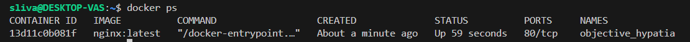
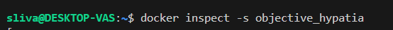
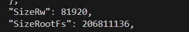
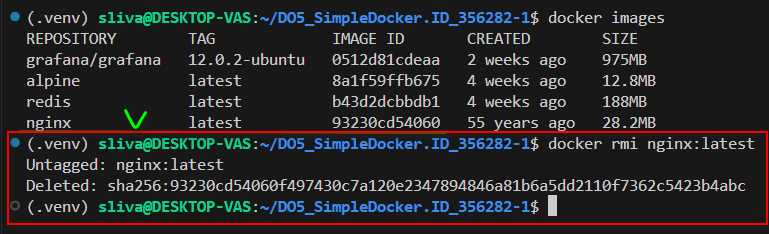
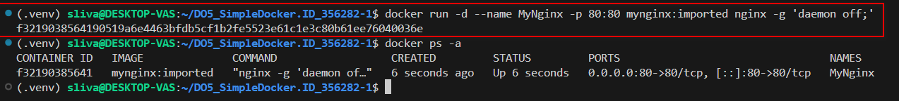

Решение "Simple Docker"

- [Part 1. Готовый докер](#part-1-готовый-докер)
- [Part 2. Операции с контейнером](#part-2-операции-с-контейнером)
  
## Part 1. Готовый докер

- `docker pull`

- `docker images`

- `docker run -d [repository]`
 

- `docker ps`
 

- `docker inspect [container_name]`

Проброса портов внутрь контейнера нет, а только информация, что контейнер слушает на порту 80. Проброс достигается запуском контейнера с ключом -p и указанием номеров портов для проброса, например: 

`-p 8080:80`

- `docker stop [container_id]`

- `docker run -d -p 80:80 -p 443:443 [container_id]`

  

- Запуск браузера по адресу `localhost:80`

  

- `docker restart [container_name]`

 

 

## Part 2. Операции с контейнером

- `docker exec nginx cat /etc/nginx/nginx.conf` 
  

 

- `nano src/nginx.conf` 

 

- `docker cp src/nginx.conf dreamy_dijkstra:/etc/nginx/nginx.conf` 
 

  

- `docker exec dreamy_dijkstra nginx -s reload`

  

- `localhost:80/status`  

 

- `docker export [CONTAINER ID] -o src/container.tar`  

 

- `docker stop [CONTAINER ID]`

 

- `docker rm [CONTAINER ID]`

 

- `docker rmi [repository]`

 

- `docker import src/container.tar mynginx:imported`

 

- `docker run -d --name MyNginx -p 80:80 mynginx:imported nginx -g 'daemon off;'`  

 

- `curl http://localhost/status`  

 

****

Part 3. Мини веб-сервер

- мини-сервер на **C** и **FastCgi**, который будет возвращать простейшую страничку с надписью `Hello, World!`.

 

- *nginx.conf*, который будет проксировать все запросы с 81 порта на *127.0.0.1:8080*.
  

 
